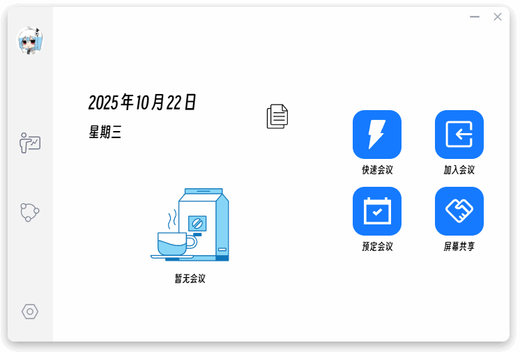
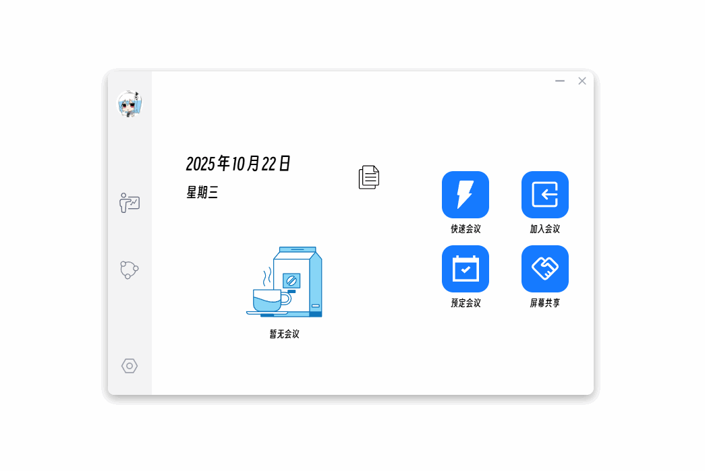
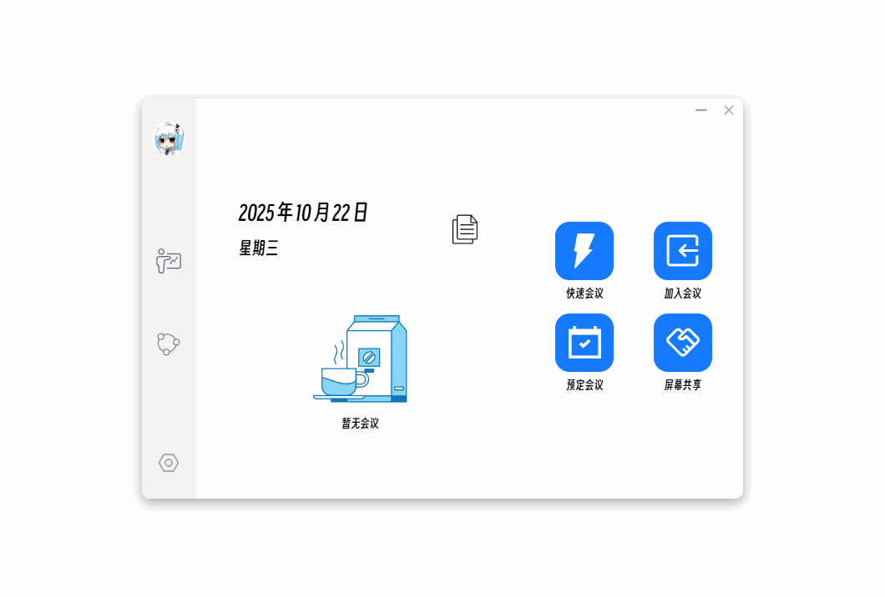
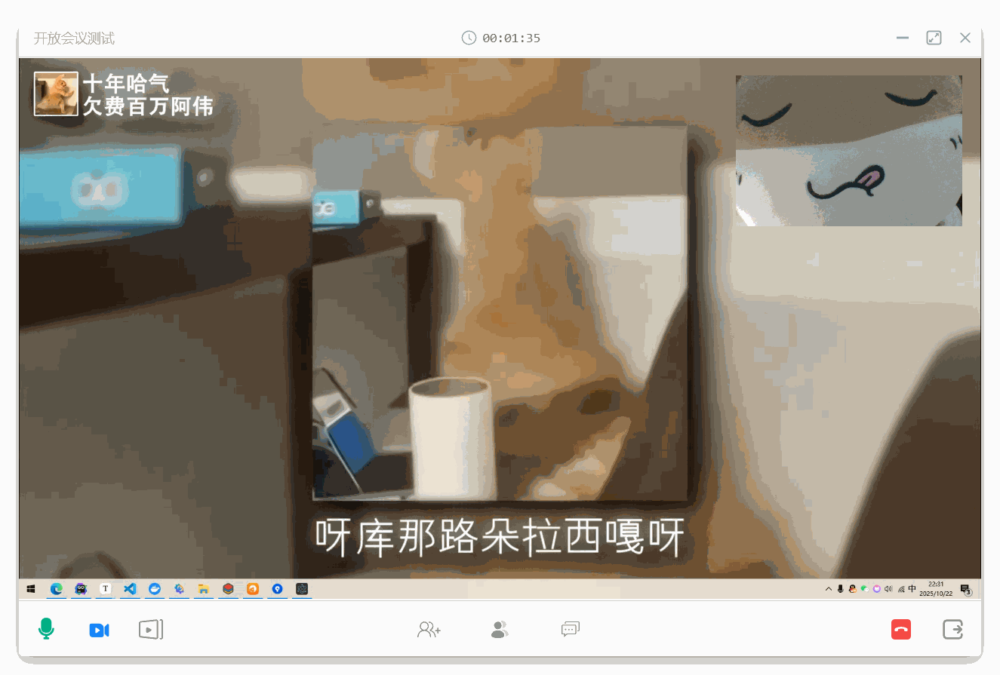
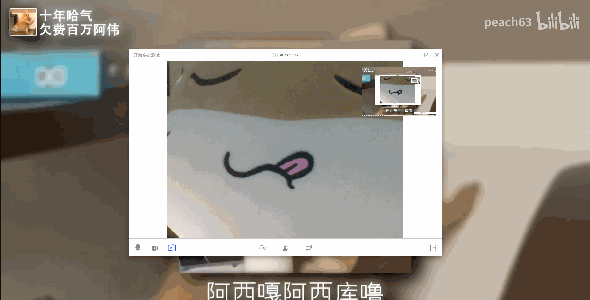

# GoMeeting Client

一个基于 Electron、Vue 3 和 TypeScript 构建的实时音视频通讯和屏幕共享会议客户端应用。

## 效果展示

**登录和注册界面**


**主界面**



**开启会议**



**加入会议**



**实时音视频通讯与屏幕共享**

*已实现多人实时音视频通讯，因设备不足暂不提供演示*

*因gif画质压缩导致画面较为模糊，若加载不出来请查看 README.assets 文件夹*

客户端A开启摄像头与麦克风同时接收客户端B的屏幕共享



客户端B进行屏幕共享同时接收客户端A的摄像头与语音信息



## 功能特性

- [x] 实时音视频通话
- [x] 多人会议支持
- [x] 屏幕共享功能
- [x] 自适应视频布局
- [x] 用户友好的界面设计

## 技术栈

- **框架**: [Electron](https://www.electronjs.org/) + [Vue 3](https://vuejs.org/)
- **语言**: TypeScript
- **状态管理**: Pinia
- **路由**: Vue Router
- **UI组件库**: Element Plus
- **构建工具**: Vite + electron-vite
- **代码规范**: ESLint + Prettier

## 推荐 IDE 设置

- [VSCode](https://code.visualstudio.com/) + [ESLint](https://marketplace.visualstudio.com/items?itemName=dbaeumer.vscode-eslint) + [Prettier](https://marketplace.visualstudio.com/items?itemName=esbenp.prettier-vscode) + [Volar](https://marketplace.visualstudio.com/items?itemName=Vue.volar)

## 项目结构

```
src/
├── main/           # 主进程代码
├── preload/        # 预加载脚本
├── renderer/       # 渲染进程代码
│   ├── assets/     # 静态资源
│   ├── components/ # Vue组件
│   ├── store/      # 状态管理
│   ├── utils/      # 工具函数
│   └── views/      # 页面视图
└── resources/      # 应用资源文件
```

## 项目设置

### 安装依赖

```bash
$ npm install
```

### 开发模式

```bash
$ npm run dev
```

### 类型检查

```bash
# 检查Node.js类型
$ npm run typecheck:node

# 检查Web类型
$ npm run typecheck:web

# 全部类型检查
$ npm run typecheck
```

### 代码格式化

```bash
$ npm run format
```

### 代码检查

```bash
$ npm run lint
```

### 构建应用

```bash
# 构建并预览
$ npm run start

# 构建应用
$ npm run build

# 构建为未打包的应用
$ npm run build:unpack

# Windows平台打包
$ npm run build:win

# macOS平台打包
$ npm run build:mac

# Linux平台打包
$ npm run build:linux
```

## 目录说明

- `build/` - 构建相关配置
- `resources/` - 应用图标等资源文件
- `src/main/` - Electron主进程代码
- `src/preload/` - 预加载脚本
- `src/renderer/` - 渲染进程代码（Vue应用）
- `src/renderer/components/` - Vue组件
- `src/renderer/views/` - 页面组件
- `src/renderer/store/` - 状态管理
- `src/renderer/utils/` - 工具函数

## 开发指南

### 添加新功能

1. 在`src/renderer/components/`中创建新组件
2. 在`src/renderer/views/`中创建新页面
3. 在`src/renderer/router/index.ts`中添加路由
4. 在`src/renderer/store/`中添加相关状态管理

### 音视频处理

项目使用WebRTC技术实现实时音视频通信，主要实现在`src/renderer/utils/webrtc.ts`中。

### 屏幕共享

屏幕共享功能通过Electron的desktopCapturer API实现，相关代码在`src/renderer/components/Screen.vue`中。

## 贡献

欢迎提交Issue和Pull Request来改进项目。

## 许可证

[MIT](LICENSE)